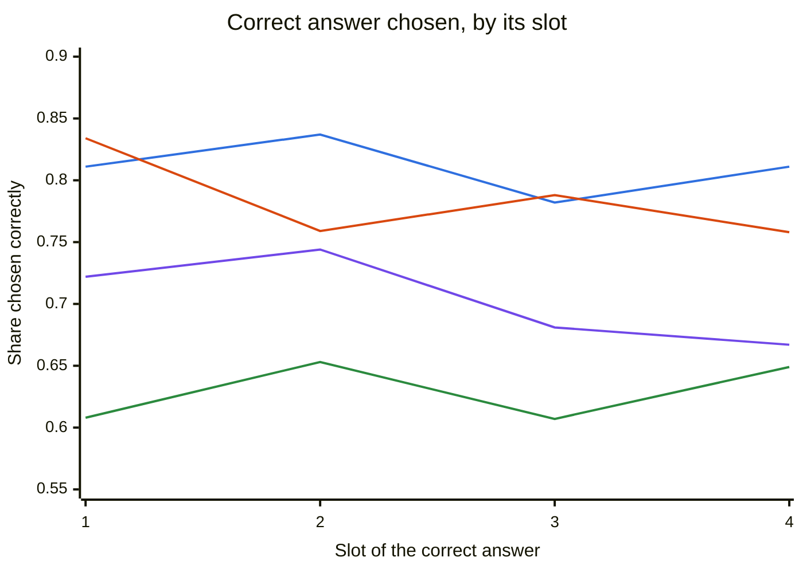
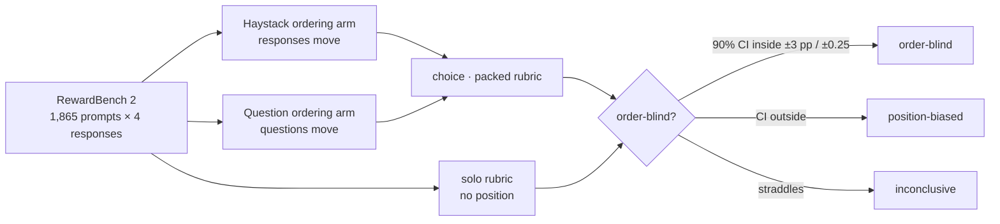
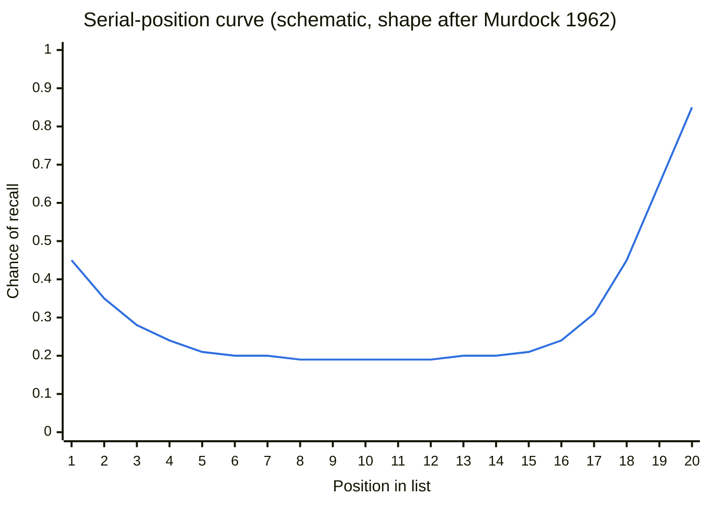

# Order-blind decisions

**Do decision models judge responses differently depending on where those responses appear?**

## TL;DR

On all 1,865 RewardBench 2 prompts, each with four responses rotated through every position (76,200 requests per model):

- **Jev is order-blind** on the preregistered test. Moving the correct answer to the first or last slot changes how often Jev picks it by **+0.2 pp** (90% CI [−0.8, +1.2] and [−0.7, +1.0]), well inside the ±3 pp margin. Its ratings move by at most 0.06 points on a 1–10 scale. It is also the most accurate of the four (80.9%).
- **OpenAI Decisions favors whatever comes first.** It picks the correct answer **6.1 pp more often when it is first** ([+4.7, +7.4]), lands on slot 1 **29.9%** of the time instead of 25%, and rates the first response **+0.26** higher. Identical repeats give identical answers, so this is systematic.
- **Microsoft-Decision-1 disfavors whatever comes last.** It picks the correct answer **4.5 pp less often when it is last** ([−5.6, −3.4]), which fails the ±3 pp margin; slot 1 is about neutral. Accuracy is 70.9%. Microsoft reports "zero flips" when answer options are reordered. Here, reordering only the options changed its pick in **5.1%** of cases, close to its own retest noise (2.6%). Reordering the responses changed it in **31.9%**. It was added after the plan was frozen, using the identical plan.
- **Cloudflare Clef-flash is inconclusive and much weaker.** It shows a mild zigzag by slot (−2.1 pp at slot 1, +1.9 pp at slot 4) and is the least accurate judge (62.7%).
- **Caveat 1, exact ties.** When two answers are equally correct, three models usually pick the one shown first: Jev **71.5%**, Decisions **88.6%**, Clef-flash **69.1%**. An order-blind judge would pick it 50% of the time. Microsoft-Decision-1 is the exception at **52.8%**.
- **Caveat 2, Math (exploratory).** All four show primacy on RewardBench 2's Math subset: Jev +9.0 pp, Decisions +30.3 pp, Clef-flash +11.5 pp, Microsoft-Decision-1 +5.7 pp.
- **Refusals.** Decisions refused to judge 338 choice requests, almost all on harmful-content prompts in the Safety subset. The other three never refused.
- **Cost.** The whole project cost **$43.08** at list price.

| | Jev | OpenAI Decisions | Clef-flash | Microsoft-Decision-1 |
|---|---|---|---|---|
| **Verdict** (preregistered) | ✅ **order-blind** | 🟥 **position-biased** | 🟨 inconclusive | 🟥 **position-biased** |
| Choice accuracy | **80.9%** | 78.2% | 62.7% | 70.9% |
| Correct answer chosen, by its slot 1 · 2 · 3 · 4 | 81.1 · 83.7 · 78.2 · 81.1% | **83.4** · 75.9 · 78.8 · 75.8% | 60.8 · 65.3 · 60.7 · 64.9% | 72.2 · 74.4 · 68.1 · **66.7**% |
| Choice primacy, slot 1 − middle (±3 pp) | +0.2 [−0.8, +1.2] | **+6.1 [+4.7, +7.4]** | −2.1 [−3.5, −0.8] | +1.0 [−0.2, +2.2] |
| Choice recency, slot 4 − middle (±3 pp) | +0.2 [−0.7, +1.0] | −1.5 [−2.7, −0.4] | +1.9 [+0.8, +3.0] | **−4.5 [−5.6, −3.4]** |
| Rating primacy, slot 1 − middle (±0.25) | +0.04 [+0.02, +0.05] | **+0.26 [+0.24, +0.28]** | +0.08 [+0.07, +0.09] | +0.09 [+0.07, +0.11] |
| Rating recency, slot 4 − middle (±0.25) | −0.06 [−0.07, −0.05] | −0.03 [−0.04, −0.01] | +0.12 [+0.12, +0.13] | −0.08 [−0.08, −0.07] |
| Primacy vs. Jev | — | **+5.8 pp [+4.3, +7.4]** | −2.4 pp [−4.0, −0.7] | +0.8 pp [−0.6, +2.2] |
| Recency vs. Jev | — | −1.7 pp [−3.1, −0.3] | +1.8 pp [+0.4, +3.1] | **−4.6 pp [−6.0, −3.3]** |
| Share of picks in slot 1 (25% is fair) | 25.3% | **29.9%** | 24.3% | 26.9% |
| Same winner in all 4 response orderings | **79.2%** | 65.4% | 64.5% | 68.1% |
| Pick changed when only answer options were reordered | 6.0% | 21.8% | **2.5%** | 5.1% |
| Exact ties: earlier answer wins (50% is fair) | 71.5% | **88.6%** | 69.1% | **52.8%** |
| Math primacy (exploratory) | +9.0 pp | **+30.3 pp** | +11.5 pp | +5.7 pp |
| Requests with a refusal | 0 | 1,786 | 0 | 0 |
| Cost at list price (main run) | $6.94 | $14.76 | $14.86 | $5.90 |
| Latency p50 / p95 | 105 / 149 ms | 113 / 272 ms | 260 / 638 ms | 307 / 414 ms |

- **Intervals and margins.** Brackets are 90% cluster-bootstrap intervals over items. The margins in parentheses are the preregistered order-blind thresholds.
- **Microsoft-Decision-1.** It ran through OpenRouter, after the other three, using the identical frozen plan.
- **Where to read more.** [`results/analysis.md`](results/analysis.md) is the full written analysis. [`results/`](results/README.md) indexes every result, and [`results/main-report.md`](results/main-report.md) has every number.

*Lines: Jev blue, OpenAI Decisions orange, Clef-flash green, Microsoft-Decision-1 purple.*

*A flat line is order-blind. A line that starts high, like Decisions', is primacy; one that ends low, like Microsoft-Decision-1's, disfavors the last slot.*

## What this study is

Language models are known to show **primacy** (favoring what comes first) and **recency** (favoring what comes last) effects, including as judges; see [`sources/`](sources/README.md). This study asks whether *decision models* do too. These are models that return typed answers with probabilities instead of generated text.

| Model | Role |
|---|---|
| Jev (`jev-1.13.0`) | reference; hypothesized to be order-blind |
| OpenAI Decisions (`gpt-6-luna`) | Jev-compatible decision model |
| Cloudflare Clef-flash (`clef-flash`) | Jev-compatible decision model |
| Microsoft-Decision-1 (`microsoft/microsoft-decision-1`, via OpenRouter) | Jev-compatible decision model; added after the plan was frozen (2026-10-09) |

Every result is reported both per model and as a paired difference from Jev on identical requests.

## Background: the serial-position curve

In 1962 Bennet Murdock read people lists of words and asked them to recall as many as they could, in any order ([Murdock 1962](https://doi.org/10.1037/h0045106)). Recall by list position traced a **U-shaped curve**:

- **Primacy:** the first few words were remembered better than the middle.
- **Recency:** the last few were remembered best of all.
- **The middle** was a flat trough.

*Schematic only: the values illustrate the curve's shape and are not Murdock's measurements.*

Language models show the same U. *Lost in the Middle* (Liu et al. 2023) found that models use evidence at the start or end of a long context better than evidence in the middle. LLM judges likewise favor responses by slot rather than by quality. [`sources/`](sources/README.md) collects that literature.

This study asks whether decision models trace the U or a flat line. With four responses per request, slot 1 is the primacy end and slot 4 the recency end:

| Curve | What it would mean here |
|---|---|
| Flat | Order-blind: a response is judged the same in any slot |
| Raised at slot 1 | Primacy: the first response is favored |
| Raised at slot 4 | Recency: the last response is favored |
| U-shaped | Both, as in Murdock's lists |

## Status

**v1 is complete.**

- **Truncation probe.** All three models read every request in full ([report](results/truncation-probe.md)).
- **Pilot.** It came back clean ([report](results/pilot.md)), and the plan and analysis were frozen and pushed before the main run.
- **Main run.** All 228,600 requests were answered ([analysis](results/analysis.md), [full report](results/main-report.md)).
- **Microsoft-Decision-1.** Added after the freeze (2026-10-09): it passed the same probe and pilot, then all 76,200 of its requests were answered, using the identical frozen plan.
- **Interim look.** The main run was paused once for an interim check, which is disclosed in the plan; nothing in the design changed.

Further reading:

- **Design:** [`plans/v1-design.md`](plans/v1-design.md). A wide-K follow-up (K = 8, 16, 32 on PPE Best-of-K) is in [`plans/wide-k-followup.md`](plans/wide-k-followup.md).
- **Method and reproduction:** [`docs/prompts.md`](docs/prompts.md) lists every change from RewardBench 2's prompts; [`docs/reproduce.md`](docs/reproduce.md) has the commands.

## Repository layout

| Path | Contents |
|---|---|
| [`plans/`](plans/) | design documents |
| [`docs/`](docs/) | method, prompts, reproduction, limitations |
| [`sources/`](sources/README.md) | background papers on primacy, recency and position bias |
| `runs/` | append-only JSONL receipts of every API call, committed as they happen |
| `db/` | SQLite rebuilt from `runs/` for analysis (not committed) |
| `frozen/v1/` | the frozen plan: selected items, every request and its body hash |
| [`results/`](results/README.md) | analysis, generated reports and gate results |

By **Kyle Wild**. Code is [MIT licensed](LICENSE); data, prompts and papers keep their [upstream terms](THIRD_PARTY_NOTICES.md).
