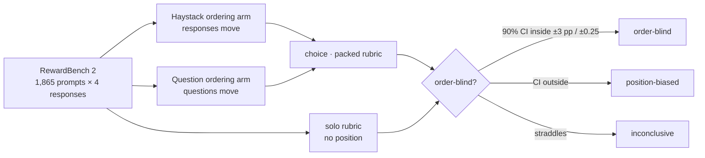

# Order-blind decisions

**Do decision models judge responses differently depending on where those responses appear?**

Language models are known to show **primacy** (favoring what comes first) and **recency** (favoring what comes last) effects, including as judges; see [`sources/`](sources/README.md). This study asks whether *decision models* do too. These are models that return typed answers with probabilities instead of generated text.

| Model | Role |
|---|---|
| Jev (`jev-1.13.0`) | reference; hypothesized to be order-blind |
| OpenAI Decisions (`gpt-6-luna`) | Jev-compatible decision model |
| Cloudflare Clef-flash (`clef-flash`) | Jev-compatible decision model |

Every result is reported both per model and as a paired difference from Jev on identical requests.

## Status

The design is settled; the harness is being built. Nothing has run yet beyond response-shape smoke tests.

- **Design:** [`plans/v1-design.md`](plans/v1-design.md). A wide-K follow-up (K = 8, 16, 32 on PPE Best-of-K) is in [`plans/wide-k-followup.md`](plans/wide-k-followup.md).
- **Method and reproduction:** [`docs/`](docs/), added as the harness lands.
- **Results:** [`results/`](results/), empty until runs complete.

## Repository layout

| Path | Contents |
|---|---|
| [`plans/`](plans/) | design documents |
| [`docs/`](docs/) | method, prompts, reproduction, limitations |
| [`sources/`](sources/README.md) | background papers on primacy, recency and position bias |
| `runs/` | append-only JSONL receipts of every API call, committed as they happen |
| `db/` | SQLite rebuilt from `runs/` for analysis (not committed) |
| `results/` | generated reports |

By **Kyle Wild**. Code is [MIT licensed](LICENSE); data, prompts and papers keep their [upstream terms](THIRD_PARTY_NOTICES.md).
