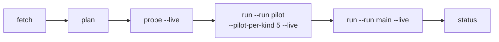

# Reproducing the study

Requires Go 1.27+. Commands run from the repository root.



```sh
go build -o order-blind .
./order-blind fetch    # download RewardBench 2 at the pinned revision; verifies SHA-256
./order-blind plan     # rebuild frozen/v1; must reproduce the committed SHA256SUMS exactly
./order-blind probe --live                                  # truncation probe (runs/probe/)
./order-blind run --run pilot --pilot-per-kind 5 --live     # pilot (runs/pilot/)
./order-blind run --run main --live                         # full run (runs/main/)
./order-blind status   # spend and progress across all runs
```

- **No `--live`, no calls.** Without `--live`, `probe` and `run` only print what they would send.
- **Body checks.** Before any call, every body is rebuilt and checked against the frozen `body_sha256`.
- **Budget.** `--budget` (default $100) caps spend across **all** receipts in `runs/`, not one invocation. Calls whose usage is unknown are reserved and charged at an estimate.
- **Resume.** Re-running a command skips requests that already have a successful receipt in that run.
- **Retries.** Up to four attempts per request, retrying 429, 408, 5xx, network errors and unparseable responses. Every attempt gets its own receipt.

## Credentials

| Provider | Route | Needs |
|---|---|---|
| Jev | `https://typesafe.int.exe.xyz/v1/systemone` | an exe.dev `typesafe` integration (injects the key) |
| OpenAI Decisions | `https://openai.int.exe.xyz/v1/decisions` | an exe.dev `openai` integration |
| Clef-flash | Cloudflare Workers AI REST API | `CLOUDFLARE_ACCOUNT_ID` and `CLOUDFLARE_API_TOKEN` (Workers AI Read is enough) |
| Microsoft-Decision-1 (`msd1`) | OpenRouter decisions API, `https://openrouter.int.exe.xyz/api/alpha/decisions` | an exe.dev `openrouter` integration (injects the key); off exe.dev, `https://openrouter.ai/api/alpha/decisions` with an OpenRouter key |

Off exe.dev, point the provider URLs in [`internal/provider/provider.go`](../internal/provider/provider.go) at the direct APIs and supply keys.
