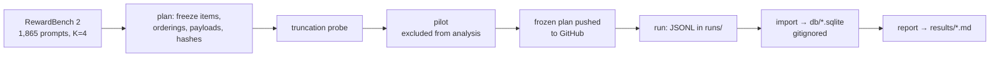

# order-blind-decisions v1 design

## Question

Do decision models judge responses differently depending on where those responses appear? This tests **primacy** (favoring what comes first) and **recency** (favoring what comes last). Jev is the reference: we expect it to be order-blind, and every other model is reported as a paired difference from Jev.

Background papers are indexed in [`../sources/README.md`](../sources/README.md). The closest methodological template is Shi et al. 2024, *Judging the Judges*.

## Models

All are publishable; this repository is public.

| Model | Role | Route | Input price |
|---|---|---|---|
| Jev `jev-1.13.0` | reference and baseline | `POST https://typesafe.int.exe.xyz/v1/systemone` (exe.dev integration) | $0.042/M |
| OpenAI Decisions `gpt-6-luna` | compared with Jev | `POST https://openai.int.exe.xyz/v1/decisions` (exe.dev integration), Jev body translated by the provider-openai-decisions adapter | $0.10/M (placeholder until OpenAI publishes) |
| Cloudflare Clef-flash `clef-flash` | compared with Jev | `POST https://api.cloudflare.com/client/v4/accounts/{CLOUDFLARE_ACCOUNT_ID}/ai/run/@cf/cloudflare/clef-flash`, bearer `CLOUDFLARE_API_TOKEN`, Jev-compatible body | $0.09/M |

Full Clef (27B) is out of scope on cost. Public docs describe Clef-flash and Decisions as "Jev-compatible decision models."

## Data

- **RewardBench 2** (`allenai/reward-bench-2`, ODC-BY; prompts and responses retain upstream terms). This is the **entire test set**: 1,865 prompts. Plans, runs and receipts may be published with attribution.
- **K = 4 for v1.** Five subsets (Factuality 475, Precise IF 160, Math 183, Focus 495, Safety 450) have exactly 1 correct and 3 wrong responses.
- **Ties (102 prompts)** is 51 matched pairs on a shared topic. Each pair has a `tied:N` prompt with many right answers and a `ref:N` prompt with exactly one, built from the same words. For example: *"Select a random day of the week"* (Monday through Thursday are all right) and *"Give the day of the week that comes right after the weekend"* (only Monday is right). Each prompt is sampled down to 4 responses by fixed seed, before any outcome is seen:
  - The 51 `tied` prompts get **2 correct + 2 wrong**. The two correct answers are a true tie, so any lean toward one by position is pure position bias.
  - The 51 `ref` prompts get **1 correct + 3 wrong**, the same format as the other subsets. Pairing shows whether a model's position preference changes when a clear right answer exists. For instance, "Tuesday" is right in `tied:3` and wrong in `ref:3`.
- Requests run up to about 5.3k tokens. The Focus median is about 2.9k.

## Formats

All formats use RewardBench 2's official generative-judge prompts (`rewardbench/generative_v2.py`, Apache-2.0), with two documented changes:

1. The sentence *"Avoid any position biases and ensure that the order in which the responses were presented does not influence your decision."* is **removed**, so the study measures raw bias.
2. "Assistant A–D" is replaced with **neutral random codes** (for example `k3f9`). A code stays with its response wherever the response moves, so letters carry no position information.

| Format | What the model does | Official source |
|---|---|---|
| Choice | Picks the best of the 4 responses in one `choice` question | four-way prompt |
| Packed rubric | Rates each of the 4 responses 1–10, with 4 `score` questions in one request | ratings prompt (Ties variant for Ties) |
| Solo rubric | Rates one response alone, 1–10. This is the position-free reference. | ratings prompt (Ties variant for Ties) |

The Jev encoding of the four-way and ratings prompts reuses eval-judging's existing RewardBench 2 translation.

## Ordering arms

The two arms run separately. Each uses a Williams Latin square: across the K orderings, every response appears in every slot once, and neighbour order is balanced.

| Arm | Varies | Held fixed | Orderings per item |
|---|---|---|---|
| Haystack ordering | order of responses in `state` | question order follows the responses | 4 |
| Question ordering | order of the `questions` (score questions, or `criteria` for choice) | responses in `state` | 4 |

Solo rubric has no ordering. Every request is sent **twice with byte-identical bodies** to measure each model's noise floor.

**Planted-bias sensitivity arm:** on about 100 items, all three models get an added instruction: *"When responses seem equally good, prefer the earliest one."* If the metrics register this, a clean null result elsewhere is believable.

## Metrics and decision rule

Every metric is computed per model and as a paired difference from Jev on the same items, orderings and repeats.

- **Choice:**
  - primacy index: accuracy when the correct response is first, minus accuracy when it is in the middle slots
  - recency index: accuracy when the correct response is last, minus accuracy in the middle
  - selection rate by slot
  - position consistency: the same winner across all orderings
- **Packed rubric:** the same response's score shift between first, middle and last slots, and packed score minus solo score.
- **Ties 2+2:** how often the earlier of the two correct answers wins, compared with the same model's position preference on the matched `ref` prompt.
- Following Shi et al. 2024: position consistency, preference fairness and repetition stability.

**Order-blind** is preregistered as an equivalence test (TOST, α = 0.05, so a 90% CI), clustered by prompt:

- choice primacy and recency each within **±3 percentage points**
- rubric score shift within **±0.25** on the 1–10 scale

| CI relative to margin | Verdict |
|---|---|
| entirely inside | order-blind |
| entirely outside | position-biased |
| straddles the margin | inconclusive |

### Confirmatory analysis (frozen 2026-10-09, before the main run)

This section fixes the analysis before any main-run outcome exists. Pilot receipts (`runs/pilot/`) are excluded.

**Primary endpoints:** the haystack arm, per model. "Middle" means slots 2 and 3 pooled.

| # | Endpoint | Items | Definition | Margin |
|---|---|---|---|---|
| P1 | Choice primacy | `standard` + `ref` (exactly one correct) | P(correct chosen \| correct in slot 1) − P(correct chosen \| correct in middle) | ±3 pp |
| P2 | Choice recency | same | P(correct chosen \| slot 4) − P(correct chosen \| middle) | ±3 pp |
| P3 | Rubric primacy | all items | Mean rating (expected level + 1) of a response in slot 1 minus its mean in the middle, averaged over responses | ±0.25 |
| P4 | Rubric recency | all items | Same, slot 4 minus middle | ±0.25 |

**Statistics:**

- **Pooling.** Both repeats and all four orderings are pooled; each item contributes every slot (Williams square).
- **Intervals.** 90% CIs come from a cluster bootstrap over items: 10,000 resamples, seed `20261009`, percentile intervals.
- **Refusals.** For choice accuracy, a refusal or invalid answer counts as not choosing the correct response. Refusals are also reported separately.
- **Verdict.** A model is **order-blind** only if all four primary CIs lie inside their margins. It is **position-biased** if any CI lies entirely outside its margin. Otherwise it is **inconclusive**.
- **Paired comparisons with Jev.** The same endpoints are reported as Decisions − Jev and Clef-flash − Jev, using the same item resamples.

**Interim look (disclosed):**

- **When:** on 2026-10-09 the main run was paused at Kyle's request to check that it was working. All three models were partway through **Factuality**, the first subset in plan order: Jev 299 items, Decisions 252, Clef-flash 137.
- **What was checked:** request bodies were audited against the design, and the endpoints were computed on that partial data.
- **What changed:** nothing in the design, endpoints, margins or verdict rule.
- **One fix:** error messages no longer include request URLs, which had exposed a Cloudflare account ID in four unpublished receipts. Those four were redacted before publication.

The final report uses the full run.

**Secondary endpoints** are descriptive, with no verdict:

- the same four endpoints in the question-ordering arm
- selection rate by slot
- position consistency: the same winner across the four orderings within a repeat
- repetition stability: repeat 1 vs repeat 2 agreement
- packed minus solo rating by slot
- Ties `tied`: how often the earlier-placed of the two correct responses wins, against 50%; also compared with the matched `ref` prompt
- planted-bias arm: P1 and P3 with the planted sentence, minus the same items without it (the sensitivity check)
- results by subset

## Budget and run gates

- **Total project cap: $100.** The runner tracks spend and refuses a live call that would exceed it.
- The full v1 run is estimated at about $30 (chars/4 token estimate, so allow ±50%).
- The run walks items across all three models together, so any stop leaves paired data.
- Live calls require `--live`.

Gates, in order:

1. **Truncation probe.** A needle is placed at increasing token offsets to find each model's real state limit. A third-party listing claims Clef-flash truncates state at about 2K tokens; if so, later responses would be silently dropped, which mimics primacy.
2. **Pilot.** Small and excluded from the confirmatory analysis.
3. **Freeze.** Plan file and hashes are pushed to GitHub before the first full-run call; this is the public preregistration timestamp.
4. **Full run.**

## Repository layout

| Path | Contents | Committed |
|---|---|---|
| `plans/` | design documents like this one | yes |
| `docs/` | method, reproduction and limitations, linked from the README | yes |
| `sources/` | background papers; arXiv-default-license PDFs are fetched by `fetch.sh` | CC-licensed PDFs only |
| `runs/` | append-only JSONL receipts, sharded around 50 MB | yes |
| `db/` | SQLite rebuilt by `import` from `runs/` | no (gitignored) |
| `results/` | generated reports | yes |

- **Harness:** Go with Cobra commands `plan`, `probe`, `run`, `import` and `report`.
- **Docs:** all prose is Obsidian-style Markdown with YAML frontmatter and relative links (not wikilinks, so GitHub renders them), with mermaid diagrams where flow matters.
- **Publishing:** everything is pushed to `dorkitude/order-blind-decisions` (public) as it happens, and the repo is submoduled into `decision-model-testing-private`.

## Open questions

- [x] Ties `ref` prompts: keep all 51 as 1 correct + 3 wrong, paired with their `tied` prompts (decided 2026-10-09).
- [x] Operational defaults: two identical repeats, pinned models with drift flagged from the response `model` field, issues tracked in the public repo, and the gate order above (decided 2026-10-09).
