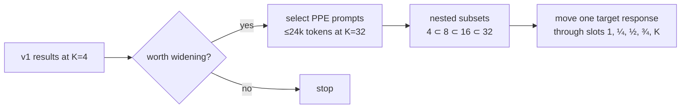

# Wide-K follow-up (K = 4, 8, 16, 32)

v1 runs at K = 4. This follow-up extends the test to K = 8, 16 and 32 if v1 shows it's worth it. Primacy and recency in LLMs usually grow with list length.

## Why RewardBench 2 can't do this

1,763 of its 1,865 prompts have exactly 4 responses. Only Ties goes wider: 71 prompts reach 16 candidates and 8 reach 32, all one-word answers.

## Data: PPE Best-of-K

LMArena's *Preference Proxy Evaluations*: each prompt has **32 model responses, each automatically checked correct or incorrect**. The responses come from Llama 3 8B Instruct, Claude 3 Haiku, Gemma 2 9B and GPT-4o-mini.

| Set | Prompts | Prompt license | Fit ≤24k tokens at K=32 |
|---|---|---|---|
| `lmarena-ai/PPE-MMLU-Pro-Best-of-K` | 512 | MIT | 505 |
| `lmarena-ai/PPE-MATH-Best-of-K` | 512 | MIT | 486 |
| `lmarena-ai/PPE-IFEval-Best-of-K` | 512 | Apache-2.0 | 475 |
| `lmarena-ai/PPE-MBPP-Plus-Best-of-K` | 507 | Apache-2.0 | 506 |
| ~~`lmarena-ai/PPE-GPQA-Best-of-K`~~ | 512 | CC BY 4.0 | excluded |

- **GPQA is excluded.** Its authors ask that questions never appear in plain text online (each row carries a canary string), and this repository publishes its runs.
- **Response terms.** Model outputs fall under each provider's terms. Record this in THIRD_PARTY_NOTICES.

Estimated request sizes (chars/4):

| K | Median | 90th percentile |
|---|---|---|
| 4 | ~1.2k | ~2.5k |
| 8 | ~2.3k | ~5k |
| 16 | ~4.6k | ~10k |
| 32 | ~9–12k | ~16–22k |

These stay inside Jev's 32k and Clef-flash's 65k windows. The truncation probe must confirm the real limits first.

## Design

- **Nested subsets.** K = 4 ⊂ 8 ⊂ 16 ⊂ 32 come from the same prompt, so only list length changes.
- **Target-moving, as in *Lost in the Middle*.** With 32 responses several are usually correct, so "pick the single right answer" doesn't apply. Instead, one target response moves through slots 1, ¼, ½, ¾ and K while the others stay put. Primacy is then whether the target is picked or scored higher at slot 1 than in the middle. This works for any mix of correct and wrong responses and needs 5 orderings instead of K.
- **Budget.** About 300 prompts (75 per set) across all four K values, both arms, choice plus packed and solo rubric, two repeats and three models: roughly $50 estimated.
