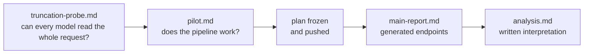

# Results

Every result in this folder is computed from the committed receipts in [`../runs/`](../runs/). Rebuild the database with `./order-blind import` and regenerate the report with `./order-blind report`. The gates ran in this order:

| Document | What it is | Headline |
|---|---|---|
| [`analysis.md`](analysis.md) | **Start here.** Written analysis of the main run, with charts and caveats | Jev is order-blind on the preregistered test; OpenAI Decisions favors the first response (+6.1 pp); Clef-flash is inconclusive and least accurate. All three break exact ties toward the earlier answer, and all three show primacy on Math. |
| [`main-report.md`](main-report.md) | Generated report: every preregistered and secondary endpoint for all 76,200 requests per model, with 90% bootstrap intervals | Primary endpoints, paired differences from Jev, question-order arm, consistency, ties, planted-bias check, per-subset results, refusals, cost and latency |
| [`pilot.md`](pilot.md) | Pilot on 35 seeded items (1,400 requests per model) | 4,200/4,200 valid answers, no refusals, $0.51; answers were not inspected for position effects |
| [`truncation-probe.md`](truncation-probe.md) | Needle-at-start/end probe of how much request text each model reads | No truncation up to about 9,700 tokens for any model, so no v1 request was cut short; $0.026 |

Raw receipts: [`../runs/probe/`](../runs/probe/), [`../runs/pilot/`](../runs/pilot/), [`../runs/main/`](../runs/main/). The frozen plan is in [`../frozen/v1/`](../frozen/v1/) and the design in [`../plans/v1-design.md`](../plans/v1-design.md).
