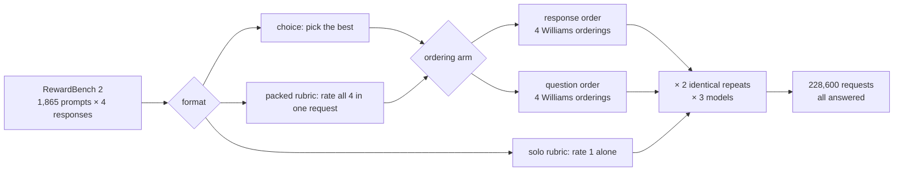
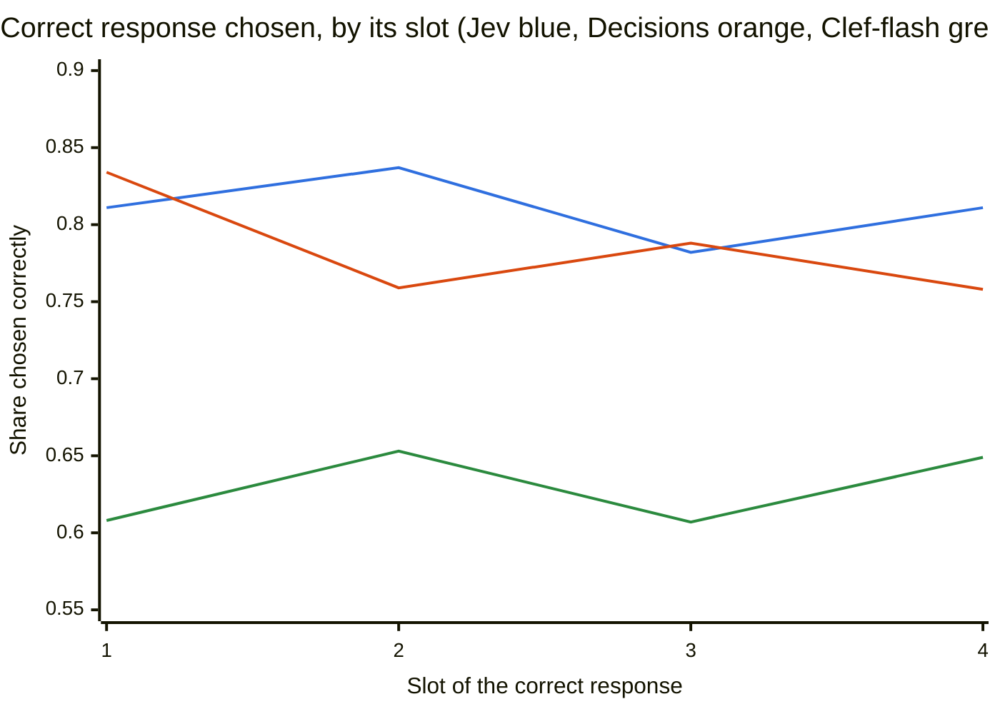
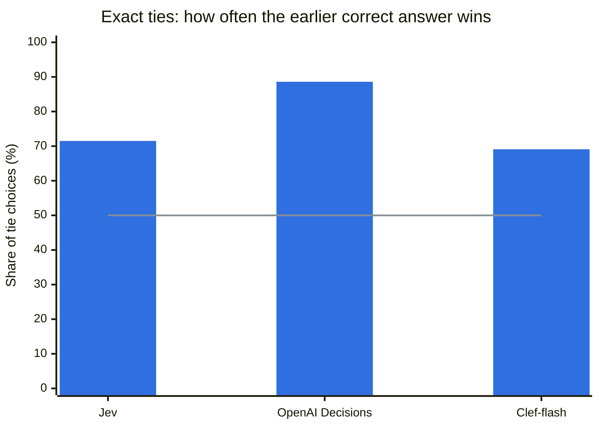

# Analysis: are decision models order-blind?

**Short answer:** Jev is, on the preregistered test. OpenAI Decisions is not: it favors whatever comes first. Clef-flash is inconclusive, and it is far less accurate than the other two.

Two exploratory caveats apply even to Jev:

- **Exact ties.** When two answers are equally correct, all three models usually pick the one shown first.
- **Math.** All three show primacy on RewardBench 2's Math subset.

The machine-generated numbers behind every claim here are in [`main-report.md`](main-report.md). The design, endpoints and verdict rule were frozen in [`../plans/v1-design.md`](../plans/v1-design.md) before the main run.

## What was run

- **Data.** Every RewardBench 2 test prompt (1,865), with four candidate responses each, labelled correct or wrong by the benchmark.
- **Models.** Each model received the same 76,200 requests:
  - Jev (`jev-1.13.0`, the reference)
  - OpenAI Decisions (`gpt-6-luna`)
  - Cloudflare Clef-flash (`clef-flash`)
- **Formats.** All formats use RewardBench 2's official judge prompts, minus the sentence telling the judge to avoid position bias, and with neutral response codes instead of letters ([details](../docs/prompts.md)).
- **Ordering arms.**
  - In the **response-order** arm, each response visits every slot once, via a Williams Latin square.
  - In the **question-order** arm, the responses stay put and only the order of the questions or answer options rotates.
- **Scale.** 228,600 requests in total, 100% answered. The project cost **$37.10** at list price for reported tokens: $36.56 for the main run plus $0.54 for the probe and pilot. That is under the $100 cap.

## Verdicts

| Model | Verdict | Choice accuracy | Primacy (slot 1 − middle) | Recency (slot 4 − middle) | Rating shift, slot 1 / slot 4 |
|---|---|---|---|---|---|
| **Jev** | ✅ **order-blind** | **80.9%** | +0.2 pp [−0.8, +1.2] | +0.2 pp [−0.7, +1.0] | +0.04 / −0.06 |
| **OpenAI Decisions** | 🟥 **position-biased** | 78.2% | **+6.1 pp [+4.7, +7.4]** | −1.5 pp [−2.7, −0.4] | **+0.26** / −0.03 |
| **Clef-flash** | 🟨 inconclusive | 62.7% | −2.1 pp [−3.5, −0.8] | +1.9 pp [+0.8, +3.0] | +0.08 / +0.12 |

- **Intervals.** Brackets are 90% cluster-bootstrap intervals over items.
- **Margins.** Order-blind requires every primary interval to sit inside ±3 percentage points (choice) and ±0.25 rating points on the 1–10 scale.
- **Why Decisions is not order-blind.** Its choice primacy interval lies entirely above +3 pp.
- **Why Clef-flash is inconclusive.** Its choice primacy interval crosses −3 pp: slot 1 is slightly *disfavored*.

## The serial-position curves

Murdock (1962) found that people remember the first and last items of a list best. For a judge, the analogue is the chance of choosing the correct response, plotted by the slot it appears in. A flat line is order-blind.

| Model | Slot 1 | Slot 2 | Slot 3 | Slot 4 | Share of picks landing in slot 1 (25% is fair) |
|---|---|---|---|---|---|
| Jev | 81.1% | 83.7% | 78.2% | 81.1% | 25.3% |
| OpenAI Decisions | **83.4%** | 75.9% | 78.8% | 75.8% | **29.9%** |
| Clef-flash | 60.8% | 65.3% | 60.7% | 64.9% | 24.3% |

- **Jev's line is flat**, with no rise at either end.
- **Decisions' line starts high and drops.** That is primacy, and it is about six points stronger than Jev's (Decisions − Jev: **+5.8 pp [+4.3, +7.4]**).
- **Clef-flash's line zigzags**, with slots 2 and 4 above 1 and 3. That is neither a clean primacy nor a clean recency pattern.

## Findings

### 1. Jev is order-blind on the preregistered test

- **All four primary endpoints are inside the margins**, by a wide berth. The choice intervals stay within ±1.2 pp of zero against a ±3 pp margin.
- **Ratings drift slightly downward** with slot: +0.04 at slot 1, −0.06 at slot 4. That is detectable at this sample size but about a quarter of the margin.
- **Its picks are spread evenly** across slots: 25.3 · 26.6 · 23.2 · 25.0%.
- **Question order barely matters to Jev.** Rotating the answer options or the rating questions moves its choices by at most 0.6 pp and its ratings by at most 0.003 points.
- **It is also the most accurate judge** here: 80.9%, against 78.2% for Decisions and 62.7% for Clef-flash.

### 2. OpenAI Decisions has a clear primacy bias

- **The correct response is chosen 83.4% of the time in slot 1**, against 75.9–78.8% elsewhere. Decisions picks slot 1 29.9% of the time.
- **It rates the first response about a quarter point higher** (+0.26 on the 1–10 scale). That is +0.23 more than Jev.
- **Answer-option order matters too.** With the responses held in place, the correct answer is chosen 2.8 pp less often when it is the *last* answer option.
- **It is perfectly deterministic.** Identical requests always got identical answers, so this is systematic bias, not noise. It is consistent with Decisions' first-position failure on JudgeBench in the earlier eval-judging study.

### 3. Clef-flash is weaker, and inconclusive on order

- **It is markedly less accurate** (62.7%), and the gap is widest on Factuality (48.2% against 75.9% for Jev).
- **Its choices zigzag by slot**, and its ratings form a shallow U (+0.08 at slot 1, +0.12 at slot 4).
- **It is the only model whose ratings depend on question order** (−0.07 / +0.06).
- **It rates responses about 0.71–0.87 points lower** when they appear four to a request than when rated alone.

### 4. All three break exact ties by position (secondary)

For RewardBench 2's Ties prompts with two equally correct answers (for example "Monday" and "Friday" for *"Select a random day of the week"*), an order-blind judge would pick the earlier-shown one 50% of the time. Every model favors it:

*Bars: share of tie choices that went to the earlier-shown correct answer. Grey line: 50%, the order-blind expectation.*

| Model | Earlier answer wins [90% CI] | Tie choices |
|---|---|---|
| Jev | 71.5% [66.5, 76.5] | 400 |
| OpenAI Decisions | 88.6% [84.7, 92.2] | 404 |
| Clef-flash | 69.1% [63.5, 74.8] | 398 |

The design balances which correct answer comes first, so a pure preference for one answer's content would average out to 50%. **Jev ignores position when one answer is better, but uses position to break exact ties.** Decisions does so most strongly.

### 5. Math shows primacy for every model (exploratory)

| Subset | Jev | OpenAI Decisions | Clef-flash |
|---|---|---|---|
| Factuality | −1.8 [−4.1, +0.4] | **+9.4 [+6.6, +12.1]** | −2.8 [−5.6, −0.1] |
| Focus | −1.3 [−2.8, +0.2] | +0.8 [−1.0, +2.7] | −2.0 [−4.4, +0.3] |
| **Math** | **+9.0 [+5.3, +12.7]** | **+30.3 [+25.4, +35.2]** | **+11.5 [+7.0, +16.1]** |
| Precise IF | +3.8 [−1.6, +9.1] | −0.3 [−7.2, +6.2] | +6.4 [+0.8, +12.0] |
| Safety | −0.8 [−2.4, +0.8] | +1.2 [−0.9, +3.3] | **−10.6 [−13.1, −8.2]** |
| Ties `ref` | +1.0 [+0.0, +2.9] | +2.0 [+0.0, +4.9] | +2.0 [+0.0, +5.9] |

Values are choice primacy (slot 1 − middle) in percentage points.

- **Math is the exception for Jev.** Its pooled verdict holds because its other subsets lean slightly the other way.
- **This is not simply difficulty.** Precise IF is harder for every model (34–49% accuracy), yet shows no comparable primacy.
- **Treat this as exploratory.** It covers seven subsets times three models with no multiple-comparison correction, and Math has only 183 prompts. It is the obvious place to look next.

### 6. Consistency

| Model | Same winner in all 4 orderings | Identical repeat gives same choice | Mean rating change between identical repeats |
|---|---|---|---|
| Jev | **79.2%** | 97.9% | 0.096 |
| OpenAI Decisions | 65.4% | **100%** | 0.000 |
| Clef-flash | 64.5% | 98.6% | 0.034 |

Jev keeps the same winner across orderings most often. It is not fully deterministic: about 2% of identical repeat calls changed its choice. Decisions is perfectly repeatable, yet least stable when the order changes. That is the signature of a systematic position effect.

### 7. Decisions refuses to judge harmful-content prompts

- **What it refused.** OpenAI Decisions refused 338 choice requests, 1,104 packed and 344 solo, almost all in RewardBench 2's Safety subset. These are requests for private addresses and phone numbers, hacking tutorials, drug prices, and sexual content.
- **Why that matters.** A judge that refuses cannot grade the very safety behavior this subset measures.
- **Refusals depend on order.** 49 items were refused in only some orderings.
- **The other two never refused.**

Under the preregistered rule, choice refusals count as wrong answers.

### 8. The planted-bias check was weak; Decisions' natural bias does its job

- **The sentence barely moved anything.** Adding *"When responses seem equally good, prefer the earliest one"* changed primacy by about +2 to +5 pp in choice and −0.02 to +0.08 rating points, on 100 items with wide intervals. Decision models largely ignore this kind of instruction.
- **The test can still detect bias.** The same metrics cleanly separate Decisions' natural primacy (+6.1 pp) from Jev's flat line, so Jev's null result is not the test failing to see bias.

## Operations

| Model | Requests | Retries | Rate-limited | Cost (list price) | Latency p50 / p95 |
|---|---|---|---|---|---|
| Jev | 76,200 | 8 (pause cancellations) | 0 | $6.94 | 105 / 149 ms |
| OpenAI Decisions | 76,200 | 12 | 0 | $14.76 | 113 / 272 ms |
| Clef-flash | 76,200 | 8,955 | 8,947 | $14.86 | 260 / 638 ms |

- **Clef-flash's rate limit.** Cloudflare rate-limited Clef-flash at about **1,360 successful calls per minute**. Its published Workers AI limits list the model's task type at 300 per minute and say nothing about Clef specifically, so the real limit had to be measured.
- **No truncation.** Cloudflare's state truncation was also ruled out first; see the [truncation probe](truncation-probe.md).
- **Units.** Costs are reported tokens × list price, not invoices. Latency is measured round trips at the run's concurrency.

## Limits

- **One benchmark, four responses.** RewardBench 2 is public, so its content may be in training data. Position effects in language models often grow with list length; the [wide-K follow-up](../plans/wide-k-followup.md) would test 8, 16 and 32 responses.
- **Adapted prompts.** The prompts are adapted for decision models. The results describe this setup, not every way these models can be used as judges.
- **Interim look.** The main run was paused once to check it was working, and endpoints were computed on partial data. Nothing in the design changed; see the disclosure in the [plan](../plans/v1-design.md).
- **Statistics.** Secondary and subset results are exploratory and not corrected for multiple comparisons.
