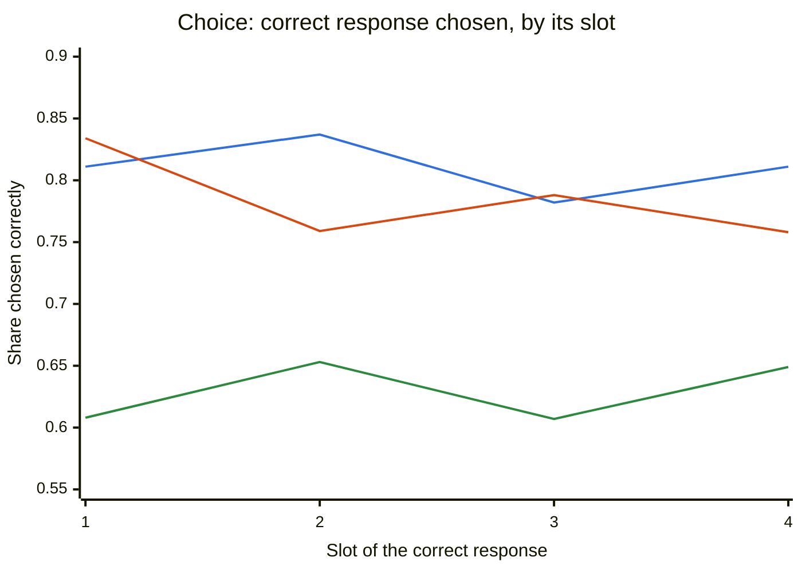
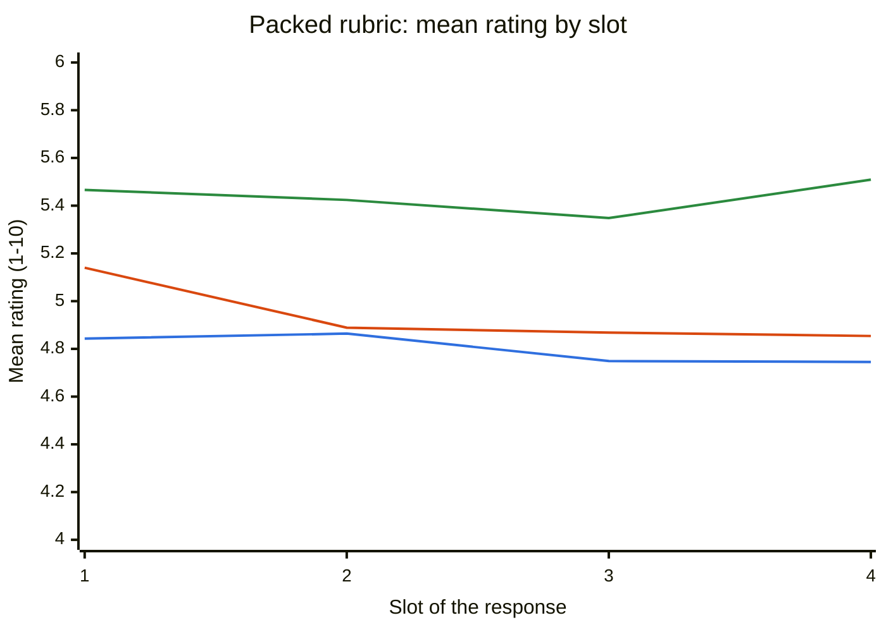

# Main run report

Generated by `order-blind report` from every receipt in `runs/main/`. The endpoints, margins and verdict rule were frozen in [`plans/v1-design.md`](../plans/v1-design.md) before the run.

## Verdicts

| Model | Verdict | Choice accuracy | Exact ties: earlier answer wins |
|---|---|---|---|
| Jev | **order-blind** | 80.9% | 71.5% [66.5, 76.5] (n=400) |
| OpenAI Decisions | **position-biased** | 78.2% | 88.6% [84.7, 92.2] (n=404) |
| Clef-flash | **inconclusive** | 62.7% | 69.1% [63.5, 74.8] (n=398) |

A model is **order-blind** only if all four primary 90% intervals lie inside their margins (±3 pp for choice accuracy, ±0.25 for the 1–10 rating). It is **position-biased** if any interval lies entirely outside its margin. Otherwise it is **inconclusive**. Choice accuracy is over all four slots and both ordering arms, on items with exactly one correct response. The ties column is a secondary endpoint: for Ties prompts with two equally correct answers, how often the model picks whichever comes first (50% is order-blind).

## Serial-position curves

Murdock's curve for these models: how often the correct response is chosen, and how a response is rated, by its slot. A flat line is order-blind; a raised end is primacy (slot 1) or recency (slot 4). Lines: Jev blue, OpenAI Decisions orange, Clef-flash green.

| Model | Choice accuracy, slots 1–4 | Mean rating, slots 1–4 |
|---|---|---|
| Jev | 81.1% · 83.7% · 78.2% · 81.1% | 4.84 · 4.86 · 4.75 · 4.74 |
| OpenAI Decisions | 83.4% · 75.9% · 78.8% · 75.8% | 5.14 · 4.89 · 4.87 · 4.85 |
| Clef-flash | 60.8% · 65.3% · 60.7% · 64.9% | 5.47 · 5.42 · 5.35 · 5.51 |

## Primary endpoints (response order)

Estimates with 90% cluster-bootstrap intervals over items (10,000 resamples, seed 20261009). Positive values favor the edge slot over the middle.

| Endpoint | Margin | Jev | OpenAI Decisions | Clef-flash |
|---|---|---|---|---|
| P1 Choice primacy (slot 1 − middle) | ±3 pp | +0.2 [-0.8, +1.2] · within margin | +6.1 [+4.7, +7.4] · outside margin | -2.1 [-3.5, -0.8] · inconclusive |
| P2 Choice recency (slot 4 − middle) | ±3 pp | +0.2 [-0.7, +1.0] · within margin | -1.5 [-2.7, -0.4] · within margin | +1.9 [+0.8, +3.0] · within margin |
| P3 Rubric primacy (slot 1 − middle) | ±0.25 | +0.036 [+0.022, +0.050] · within margin | +0.262 [+0.241, +0.283] · inconclusive | +0.081 [+0.068, +0.093] · within margin |
| P4 Rubric recency (slot 4 − middle) | ±0.25 | -0.062 [-0.069, -0.054] · within margin | -0.025 [-0.038, -0.011] · within margin | +0.123 [+0.116, +0.129] · within margin |

Choice endpoints use the 1814 items with exactly one correct response (standard subsets and Ties `ref`). Rubric endpoints use all items. Choice: a refusal or invalid answer counts as not choosing the correct response.

## Compared with Jev

The same endpoints as differences from Jev (model − Jev), on the same items and the same bootstrap resamples.

| Endpoint | OpenAI Decisions − Jev | Clef-flash − Jev |
|---|---|---|
| P1 Choice primacy (slot 1 − middle) | +5.8 [+4.3, +7.4] | -2.4 [-4.0, -0.7] |
| P2 Choice recency (slot 4 − middle) | -1.7 [-3.1, -0.3] | +1.8 [+0.4, +3.1] |
| P3 Rubric primacy (slot 1 − middle) | +0.226 [+0.205, +0.246] | +0.045 [+0.030, +0.058] |
| P4 Rubric recency (slot 4 − middle) | +0.037 [+0.022, +0.052] | +0.185 [+0.176, +0.193] |

## Question order (secondary)

The responses stay in a fixed order in `state`; only the order of the questions (packed rubric) or of the answer options (choice) rotates. The slot is the position in the question or option list.

| Endpoint | Jev | OpenAI Decisions | Clef-flash |
|---|---|---|---|
| Q1 Choice primacy, question order | +0.6 [+0.1, +1.0] | +0.4 [-0.6, +1.5] | -0.0 [-0.3, +0.2] |
| Q2 Choice recency, question order | +0.1 [-0.3, +0.5] | -2.8 [-3.7, -1.8] | +0.4 [+0.2, +0.6] |
| Q3 Rubric primacy, question order | +0.001 [-0.001, +0.003] | +0.000 [+0.000, +0.000] | -0.073 [-0.078, -0.069] |
| Q4 Rubric recency, question order | +0.003 [+0.001, +0.004] | +0.000 [+0.000, +0.000] | +0.058 [+0.056, +0.060] |

## Secondary results

Descriptive only; no verdicts.

### Which slot gets picked

Share of choice answers landing in each slot (response-order arm, all items). With correct responses spread evenly across slots, an unbiased judge picks each slot 25% of the time.

| Model | Slot 1 | Slot 2 | Slot 3 | Slot 4 | Refused or invalid |
|---|---|---|---|---|---|
| Jev | 25.3% | 26.6% | 23.2% | 25.0% | 0 |
| OpenAI Decisions | 29.9% | 22.8% | 24.3% | 21.9% | 178 |
| Clef-flash | 24.3% | 26.5% | 23.1% | 26.1% | 0 |

### Consistency

| Model | Same winner in all 4 orderings | Repeat 1 = repeat 2 (choice) | Mean \|Δ rating\| between repeats |
|---|---|---|---|
| Jev | 79.2% | 97.9% | 0.096 |
| OpenAI Decisions | 65.4% | 100.0% | 0.000 |
| Clef-flash | 64.5% | 98.6% | 0.034 |

### Rating a response with others vs. alone

Mean packed-rubric rating minus the same response's solo rating, by its slot in the packed request.

| Model | Slot 1 | Slot 2 | Slot 3 | Slot 4 |
|---|---|---|---|---|
| Jev | +0.102 | +0.123 | +0.008 | +0.004 |
| OpenAI Decisions | +0.194 | -0.052 | -0.069 | -0.084 |
| Clef-flash | -0.749 | -0.791 | -0.867 | -0.706 |

### Ties: two equally correct answers

For Ties `tied` prompts (two correct, two wrong), among choices that picked a correct answer: how often it was the **earlier** of the two correct answers. 50% is order-blind.

| Model | Earlier correct wins [90% CI] |
|---|---|
| Jev | 71.5% [66.5, 76.5] (n=400) |
| OpenAI Decisions | 88.6% [84.7, 92.2] (n=404) |
| Clef-flash | 69.1% [63.5, 74.8] (n=398) |

### Planted-bias check

On the 100 planted items (fewer if the run did not reach them), the planted sentence (*"When responses seem equally good, prefer the earliest one."*) should raise primacy. Shown: primacy with the sentence, without it on the same items, and the difference. If the difference is clearly positive, the metrics can detect a real primacy effect.

| Model | Endpoint | With sentence | Without | Difference |
|---|---|---|---|---|
| Jev | Choice primacy | +0.0 [-4.6, +4.6] | -2.0 [-5.9, +1.5] | +2.0 [+0.0, +4.3] |
| Jev | Rubric primacy | +0.090 [+0.030, +0.154] | +0.040 [-0.023, +0.108] | +0.050 [+0.034, +0.065] |
| OpenAI Decisions | Choice primacy | +1.5 [-5.6, +8.7] | -3.1 [-10.2, +4.1] | +4.6 [+0.0, +9.7] |
| OpenAI Decisions | Rubric primacy | +0.335 [+0.252, +0.423] | +0.255 [+0.167, +0.348] | +0.081 [+0.027, +0.137] |
| Clef-flash | Choice primacy | +0.5 [-5.9, +6.9] | -1.5 [-8.2, +5.1] | +2.0 [-1.8, +6.1] |
| Clef-flash | Rubric primacy | +0.089 [+0.038, +0.142] | +0.105 [+0.054, +0.156] | -0.016 [-0.024, -0.007] |

### By subset

Choice primacy (P1) and rubric primacy (P3) per RewardBench 2 subset.

| Subset | Model | Choice primacy | Rubric primacy |
|---|---|---|---|
| Factuality | Jev | -1.8 [-4.1, +0.4] | +0.132 [+0.107, +0.156] |
| Factuality | OpenAI Decisions | +9.4 [+6.6, +12.1] | +0.423 [+0.391, +0.456] |
| Factuality | Clef-flash | -2.8 [-5.6, -0.1] | +0.177 [+0.155, +0.198] |
| Focus | Jev | -1.3 [-2.8, +0.2] | -0.120 [-0.141, -0.099] |
| Focus | OpenAI Decisions | +0.8 [-1.0, +2.7] | +0.099 [+0.070, +0.129] |
| Focus | Clef-flash | -2.0 [-4.4, +0.3] | -0.026 [-0.048, -0.004] |
| Math | Jev | +9.0 [+5.3, +12.7] | +0.428 [+0.361, +0.500] |
| Math | OpenAI Decisions | +30.3 [+25.4, +35.2] | +0.799 [+0.706, +0.895] |
| Math | Clef-flash | +11.5 [+7.0, +16.1] | +0.376 [+0.334, +0.418] |
| Precise IF | Jev | +3.8 [-1.6, +9.1] | +0.213 [+0.164, +0.261] |
| Precise IF | OpenAI Decisions | -0.3 [-7.2, +6.2] | +0.011 [-0.039, +0.061] |
| Precise IF | Clef-flash | +6.4 [+0.8, +12.0] | +0.030 [-0.010, +0.071] |
| Safety | Jev | -0.8 [-2.4, +0.8] | -0.111 [-0.132, -0.091] |
| Safety | OpenAI Decisions | +1.2 [-0.9, +3.3] | +0.165 [+0.127, +0.202] |
| Safety | Clef-flash | -10.6 [-13.1, -8.2] | +0.007 [-0.014, +0.029] |
| Ties ref | Jev | +1.0 [+0.0, +2.9] | -0.006 [-0.032, +0.021] |
| Ties ref | OpenAI Decisions | +2.0 [+0.0, +4.9] | +0.068 [-0.042, +0.175] |
| Ties ref | Clef-flash | +2.0 [+0.0, +5.9] | +0.119 [+0.053, +0.189] |
| Ties tied | Jev | n/a | +0.035 [-0.005, +0.080] |
| Ties tied | OpenAI Decisions | n/a | +0.105 [-0.010, +0.229] |
| Ties tied | Clef-flash | n/a | -0.077 [-0.137, -0.018] |

## Refusals

Requests in which at least one question was answered with a refusal instead of a typed answer, by subset and format. Choice refusals count as not choosing the correct response; a refused rubric request has no ratings, so it drops out of the rubric endpoints for every slot at once.

| Model | Subset | Format | Requests with a refused question |
|---|---|---|---|
| OpenAI Decisions | Factuality | choice | 4 |
| OpenAI Decisions | Focus | choice | 8 |
| OpenAI Decisions | Safety | choice | 326 |
| OpenAI Decisions | Safety | packed | 1104 |
| OpenAI Decisions | Safety | solo | 344 |

Across all models, 49 items were refused in only some of their choice orderings and 2 in every ordering: whether a model refuses can itself depend on response order.

## Calls, cost and latency

| Model | Requests ok | Attempts | Rate-limited (429) | Requests with a refusal | Input tokens | Cost: reported tokens × list price | Budget-guard tally | Latency p50 / p95 |
|---|---|---|---|---|---|---|---|---|
| Jev | 76200 | 76208 | 0 | 0 | 165221678 | $6.94 | $6.94 | 105 / 149 ms |
| OpenAI Decisions | 76200 | 76212 | 0 | 1786 | 147557832 | $14.76 | $14.76 | 113 / 272 ms |
| Clef-flash | 76200 | 85155 | 8947 | 0 | 165125458 | $14.86 | $16.94 | 260 / 638 ms |

- **Cost** prices the input tokens each provider reported for successful calls at list price ($0.042/M Jev, $0.10/M Decisions, $0.09/M Clef-flash). These are accounting estimates, not invoices.
- **Budget-guard tally** is what the run's spending cap counted. It also charges every rejected or failed call that came back without usage at its estimated size, so it deliberately overstates spend.
- **Rate limits.** Only Cloudflare rate-limited (HTTP 429, *"inference request per min rate reached"*). At 16 concurrent requests Clef-flash sustained about 1,360 successful calls per minute. Cloudflare's published Workers AI limits list Clef-flash's task type (Text Generation) at 300 requests per minute and give no figure for Clef, so the real limit was found empirically. Every rate-limited call was retried until it succeeded.
- **Latency** is measured HTTP round trips at 4–16 concurrent requests per model, not intrinsic model speed.

## Limits

- RewardBench 2 is public, so its prompts and responses may appear in model training data.
- The prompts are adapted for decision models (see [`docs/prompts.md`](../docs/prompts.md)); results describe these prompts, not judging in general.
- v1 uses four responses per prompt. Position effects in LLMs often grow with list length; see [`plans/wide-k-followup.md`](../plans/wide-k-followup.md).
- Costs are reported input tokens × list price, not invoices. Latency is measured HTTP round trips at the run's concurrency, not intrinsic model speed.
