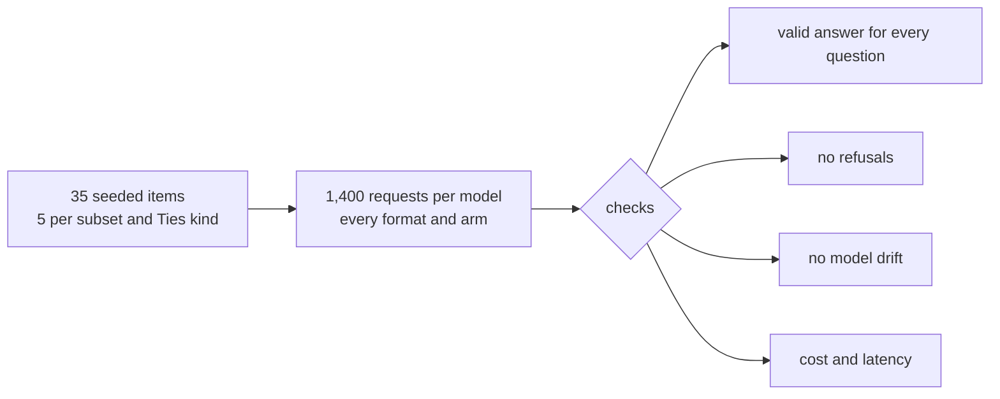

# Pilot run

**Result: the full pipeline works on all three models.** All 4,200 pilot calls returned valid typed answers on the first attempt, with no refusals. The pilot checked plumbing, cost and latency only. Its answers were not inspected for position effects and are excluded from the confirmatory analysis.

## Sample

`./order-blind run --run pilot --pilot-per-kind 5 --live` selects 5 items each from Factuality, Precise IF, Math, Focus, Safety, Ties `tied` and Ties `ref` by seeded hash rank (`design.Pilot`). Each item gets every planned request: choice and packed rubric in both ordering arms, solo rubric, two repeats, plus the planted-bias arm for any pilot item that is also a planted item.

## Results

| Model | Calls ok | Invalid answers | Refusals | Response model | Latency p50 / p95 | Cost |
|---|---|---|---|---|---|---|
| Jev | 1,400 / 1,400 | 0 | 0 | `jev-1.13.0` | 103 / 142 ms | $0.0975 |
| OpenAI Decisions | 1,400 / 1,400 | 0 | 0 | `openai-decisions/gpt-6-luna` | 113 / 193 ms | $0.2058 |
| Clef-flash | 1,400 / 1,400 | 0 | 0 | `clef-flash` | 209 / 306 ms | $0.2109 |

- **Validity.** "Valid" means the response answered exactly the planned questions: a choice among the four codes, or a score between levels 0 and 9.
- **Latency.** Measured HTTP round trips at 4 concurrent requests per model, not intrinsic model speed.
- **Cost.** Reported input tokens × list price; accounting estimates, not invoices.

**Projection.** Scaling $0.51 for 35 items to all 1,865 items gives about $27 for the main run. Together with the probe and pilot, that is well inside the $100 cap.

## Addendum: Microsoft-Decision-1 (2026-10-09)

Microsoft-Decision-1 was added after the plan was frozen and ran the same 35-item pilot through OpenRouter before its full run.

| Model | Calls ok | Invalid answers | Refusals | Response model | Latency p50 / p95 | Cost |
|---|---|---|---|---|---|---|
| Microsoft-Decision-1 | 1,400 / 1,400 | 0 | 0 | `microsoft/microsoft-decision-1-20261009` | 304 / 409 ms | $0.0790 |

One call was rate-limited (HTTP 429) and succeeded on retry. Receipts are in `runs/pilot/msd1/`.
