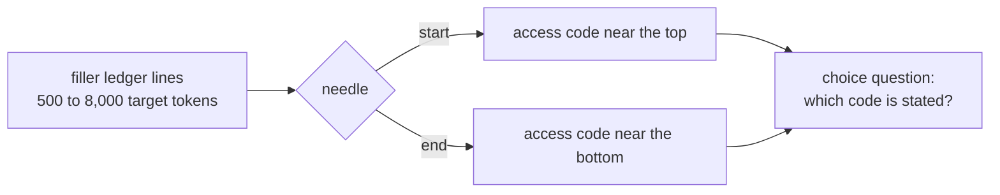

# Truncation probe

**Result: none of the three models truncated the request state at any tested length, up to about 9,700 input tokens.** The largest v1 request (24.3 KB) is smaller than the largest probe request (about 32 KB of state), so v1 requests are read in full.

## Why it was run

Every v1 response must actually be seen. A provider that silently cut off long state would drop the last responses, and that would look exactly like primacy. One third-party listing claimed Cloudflare Workers AI truncates state at about 2K tokens; this checks it.

## Method

Neutral filler text ("Ledger line 0042: crate 87 of blue cloth arrived…") is padded to 7 target lengths. The sentence *"Important: the access code for this archive is NNNN."* sits second from the top or second from the bottom. A `choice` question offers four codes. Two needle codes per cell give 28 requests per model, sent once each. A truncating model finds start needles but misses end needles beyond its limit.

## Results

Needles found (of 2), with reported input tokens in brackets:

| Target tokens | Jev start / end | Decisions start / end | Clef-flash start / end |
|---|---|---|---|
| 500 | 2/2 · 2/2 [1,004] | 2/2 · 2/2 [681] | 2/2 · 2/2 [847] |
| 1,000 | 2/2 · 2/2 [1,571] | 2/2 · 2/2 [1,156] | 2/2 · 2/2 [1,433] |
| 2,000 | 2/2 · 2/2 [2,705] | 2/2 · 2/2 [2,106] | 2/2 · 2/2 [2,605] |
| 3,000 | 2/2 · 2/2 [3,872] | 2/2 · 2/2 [3,081] | 2/2 · 2/2 [3,811] |
| 4,000 | 2/2 · 2/2 [5,007] | 2/2 · 2/2 [4,031] | 2/2 · 2/2 [4,984] |
| 6,000 | 2/2 · 2/2 [7,307] | 2/2 · 2/2 [5,956] | 2/2 · 2/2 [7,361] |
| 8,000 | 2/2 · 2/2 [9,608] | 2/2 · 2/2 [7,881] | 2/2 · 2/2 [9,739] |

- **Calls.** All 84 calls succeeded on the first attempt, with no retries.
- **Token counts.** Reported input tokens grow linearly with length for every provider, so none is capping what it counts.
- **Cost.** $0.0052 Jev, $0.0100 Decisions, $0.0111 Clef-flash (reported tokens × list price; accounting estimates, not invoices).

## Limits

- **Easy task.** The needle is unambiguous; this shows the text is *read*, not that it is weighed equally.
- **Byte size is a proxy.** Request size is compared in bytes; dense text such as code could tokenize larger. v1's largest request is about a quarter smaller than the largest probe request.

## Addendum: Microsoft-Decision-1 (2026-10-09)

Microsoft-Decision-1 was added after the plan was frozen and ran the same 28 probe requests through OpenRouter before its pilot. **It found every needle at both start and end at every length**, with reported input tokens growing linearly from 729 (target 500) to 9,621 (target 8,000). Cost: $0.005. Receipts are in `runs/probe/msd1/`.
