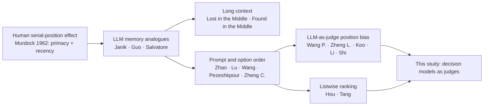

# Sources on primacy, recency and position bias in LLMs

Prior work this experiment builds on. Every language-model paper is pinned to an arXiv version and checked against [`SHA256SUMS`](SHA256SUMS). Run [`fetch.sh`](fetch.sh) to download anything missing and verify all hashes. Murdock (1962) is cited by DOI only, because no openly licensed copy exists.

## Licensing and what is committed

The public repository commits only PDFs whose license allows redistribution: CC BY, CC BY-SA, and verbatim non-commercial copies under CC BY-NC-SA or CC BY-NC-ND. Papers under arXiv's default license (`nonexclusive-distrib/1.0`) grant distribution rights to arXiv only. Those PDFs are listed in [`.gitignore`](.gitignore) and fetched locally by `fetch.sh`.

## Papers

### The original serial-position curve

| Paper | Source | License | Committed | Why it matters here |
|---|---|---|---|---|
| Murdock 1962, *The Serial Position Effect of Free Recall*, Journal of Experimental Psychology 64(5), 482–488 | [doi:10.1037/h0045106](https://doi.org/10.1037/h0045106) | APA copyright | no; no open copy exists | The classic result every paper below echoes. People recall the first few items of a list (primacy) and especially the last few (recency) far better than the middle, producing a U-shaped curve. `fetch.sh` cannot download it; save a library copy locally as `1962-murdock-serial-position-free-recall.pdf`, which is gitignored. |

### Language-model papers

| Paper | arXiv | License | Committed | Why it matters here |
|---|---|---|---|---|
| Zhao et al. 2021, *Calibrate Before Use* | [2102.09690v2](https://arxiv.org/abs/2102.09690v2) | arXiv default | no | Few-shot GPT-3 shows recency bias toward labels near the end of the prompt; introduces contextual calibration. |
| Lu et al. 2022, *Fantastically Ordered Prompts* | [2104.08786v2](https://arxiv.org/abs/2104.08786v2) | CC BY 4.0 | yes | The order of in-context examples alone swings accuracy from near state of the art to near chance. |
| Hou et al. 2023, *LLMs are Zero-Shot Rankers for Recommender Systems* | [2305.08845v2](https://arxiv.org/abs/2305.08845v2) | CC BY 4.0 | yes | Candidate order in the prompt biases LLM rankings; bootstrapping over orders mitigates it. |
| Wang P. et al. 2023, *LLMs are not Fair Evaluators* | [2305.17926v2](https://arxiv.org/abs/2305.17926v2) | arXiv default | no | Swapping response order flips LLM-judge verdicts; proposes balanced position calibration. |
| Zheng L. et al. 2023, *Judging LLM-as-a-Judge with MT-Bench and Chatbot Arena* | [2306.05685v4](https://arxiv.org/abs/2306.05685v4) | arXiv default | no | Names position bias as a core judge failure and measures consistency under swapped order. |
| Liu et al. 2023, *Lost in the Middle* | [2307.03172v3](https://arxiv.org/abs/2307.03172v3) | arXiv default | no | U-shaped accuracy: evidence at the start (primacy) or end (recency) of the context beats the middle. |
| Pezeshkpour & Hruschka 2023, *Sensitivity to the Order of Options in MCQs* | [2308.11483v1](https://arxiv.org/abs/2308.11483v1) | arXiv default | no | Reordering answer options changes results substantially, especially when the model is torn between top choices. |
| Zheng C. et al. 2023, *LLMs Are Not Robust Multiple Choice Selectors* | [2309.03882v4](https://arxiv.org/abs/2309.03882v4) | arXiv default | no | Separates option-ID token bias (for example "A") from position bias; proposes PriDe debiasing. Motivates the opaque-label arm. |
| Koo et al. 2023, *Benchmarking Cognitive Biases in LLMs as Evaluators* | [2309.17012v3](https://arxiv.org/abs/2309.17012v3) | CC BY-SA 4.0 | yes | CoBBLEr benchmark; order bias is one of several evaluator biases measured. |
| Li et al. 2023, *Split and Merge* | [2310.01432v3](https://arxiv.org/abs/2310.01432v3) | arXiv default | no | PORTIA aligns position biases in pairwise LLM evaluators. |
| Tang et al. 2023, *Permutation Self-Consistency* | [2310.07712v2](https://arxiv.org/abs/2310.07712v2) | CC BY 4.0 | yes | Aggregating rankings over shuffled orders cancels positional bias in listwise ranking. |
| Wang Y. et al. 2023, *Primacy Effect of ChatGPT* | [2310.13206v2](https://arxiv.org/abs/2310.13206v2) | CC BY 4.0 | yes | ChatGPT prefers labels listed earlier: a direct primacy effect. |
| Janik 2023, *Aspects of Human Memory and LLMs* | [2311.03839v3](https://arxiv.org/abs/2311.03839v3) | arXiv default | no | Finds human-like memory effects, including primacy and recency, in language models. |
| Shi et al. 2024, *Judging the Judges: Position Bias in LLM-as-a-Judge* | [2406.07791v9](https://arxiv.org/abs/2406.07791v9) | CC BY-NC-SA 4.0 | yes | Systematic judge study defining position consistency, preference fairness and repetition stability; bias grows as candidates get closer in quality. Closest methodological template. |
| Guo & Vosoughi 2024, *Serial Position Effects of LLMs* | [2406.15981v1](https://arxiv.org/abs/2406.15981v1) | CC BY-NC-ND 4.0 | yes | Primacy and recency across tasks and models; prompt mitigations help only inconsistently. |
| Hsieh et al. 2024, *Found in the Middle: Calibrating Positional Attention Bias* | [2406.16008v2](https://arxiv.org/abs/2406.16008v2) | arXiv default | no | Traces lost-in-the-middle to positional attention bias and calibrates it away. |
| Salvatore et al. 2025, *Lost in the Middle: An Emergent Property from Information Retrieval Demands* | [2510.10276v1](https://arxiv.org/abs/2510.10276v1) | CC BY 4.0 | yes | Argues the U-shaped curve emerges from retrieval demands, paralleling human serial-position effects. |

Summaries are brief orientation notes for this study, not reviews. Read each paper for its exact claims.
